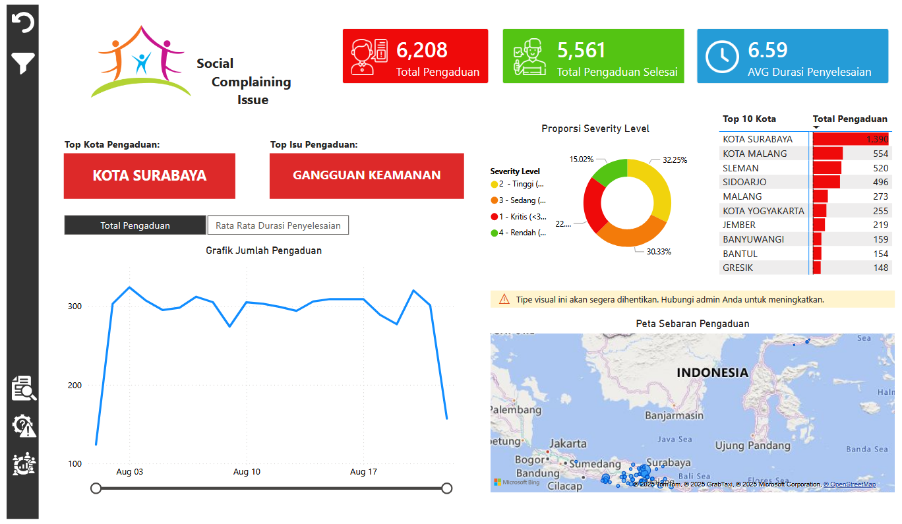

# 🏛️ Public Issue & Incident Dashboard

## 📌 Project Overview
**Public Issue & Incident Dashboard** adalah dashboard interaktif yang dibangun menggunakan **Power BI** untuk membantu pemerintah daerah, tim pelayanan publik, dan tim keamanan dalam memonitor pengaduan masyarakat terkait isu sosial, kriminalitas, serta efektivitas penyelesaian pengaduan.

Dashboard ini menyajikan insight berbasis **lokasi kejadian**, **tingkat keparahan (severity)**, **status penyelesaian**, serta **dampak sosial terhadap masyarakat**, sehingga mendukung pengambilan keputusan yang lebih cepat dan berbasis data.

---

## 📘 Project Learnings
Melalui pengerjaan dashboard ini, beberapa pembelajaran utama yang diperoleh antara lain:

- Menerjemahkan **business requirement sektor publik** ke dalam struktur dashboard analitik
- Mendesain **dashboard multi-page** untuk kebutuhan monitoring, analisis isu, dan dampak sosial
- Mengolah data pengaduan berbasis **lokasi (latitude & longitude)** untuk visualisasi peta
- Mengintegrasikan data isu sosial, kriminalitas, dan demografi dalam satu dashboard
- Membangun insight **prioritas penanganan isu** berdasarkan severity, durasi, dan dampak masyarakat

---

## 🛠 Tools Used
- **Power BI** – Data Visualization, Dashboard Development, dan DAX Calculation  
- **Microsoft Excel / CSV** – Data Cleaning, Preparation, dan Validasi Data

---

## 📊 Dashboard Structure

### 1️⃣ Overview Page
**Tujuan:**  
Memberikan ringkasan cepat terkait kondisi pengaduan masyarakat dan performa penyelesaiannya.

**Fitur Utama:**
- KPI Ringkasan:
  - Total Pengaduan
  - Total Pengaduan Selesai
  - Rata-rata Durasi Penyelesaian (Jam)
- Tren Waktu:
  - Tren jumlah pengaduan berdasarkan waktu
  - Tren rata-rata durasi penyelesaian
- Analisis Wilayah:
  - Peta sebaran pengaduan berbasis koordinat
  - Ranking provinsi, kabupaten/kota, dan kecamatan
- Distribusi Severity:
  - Proporsi pengaduan berdasarkan tingkat keparahan

---

### 2️⃣ Issue & Case Page
**Tujuan:**  
Menganalisis jenis isu sosial dan kriminal serta progres penyelesaiannya.

**Fitur Utama:**

**Analisis Isu Sosial**
- Jumlah pengaduan per kategori isu
- Severity level per jenis isu
- Ranking isu dengan pengaduan terbanyak

**Analisis Kriminalitas**
- Rata-rata aksi kriminal per pengaduan
- Perbandingan kriminal terlapor vs kriminal teratasi
- Persentase penyelesaian kriminal
- Tren kriminalitas berdasarkan waktu kejadian

**Status & SLA**
- Distribusi status pengaduan (Selesai, Proses, Belum Ditangani)
- Analisis durasi penyelesaian pengaduan
- Identifikasi kasus dengan penyelesaian di luar SLA

**Detail Pengaduan**
- ID Pengaduan  
- Jenis Isu  
- Lokasi (Provinsi → Kabupaten/Kota → Kecamatan)  
- Severity Level  
- Status  
- Durasi Penyelesaian (Jam)  
- Aksi Kriminal  
- Kriminal Teratasi  

---

### 3️⃣ Demographic & Impact Page
**Tujuan:**  
Menganalisis dampak sosial dari setiap isu berdasarkan populasi masyarakat terdampak.

**Fitur Utama:**

**Analisis Dampak Masyarakat**
- Total populasi terdampak (Pria, Wanita, Total)
- Jenis isu dengan dampak warga terbesar
- Perbandingan dampak per kecamatan dan kabupaten/kota

**Distribusi Demografi**
- Proporsi pria vs wanita terdampak
- Dampak berdasarkan severity level
- Dampak isu per wilayah

**Detail Demografi**
- ID Pengaduan  
- Jenis Isu  
- Jumlah Pria  
- Jumlah Wanita  
- Total Dampak  
- Severity Level  
- Wilayah  

---

## 📊 Key Insights & Analysis
- Wilayah dengan konsentrasi pengaduan tinggi dapat diidentifikasi secara visual melalui peta
- Isu dengan **severity tinggi dan dampak besar** dapat diprioritaskan penanganannya
- Evaluasi performa penyelesaian pengaduan menjadi lebih terukur melalui analisis durasi
- Keterkaitan antara isu sosial dan kriminalitas dapat dianalisis secara terintegrasi
- Dampak sosial dapat diukur secara kuantitatif berdasarkan populasi terdampak

---

## 📸 Dashboard Preview
```markdown


---

## 🔍 Sample Questions
Beberapa pertanyaan bisnis yang dapat dijawab oleh dashboard ini:

1. Wilayah mana yang memiliki jumlah pengaduan terbanyak?
2. Jenis isu apa yang paling sering dilaporkan masyarakat?
3. Isu apa yang memiliki severity dan dampak tertinggi?
4. Berapa rata-rata waktu penyelesaian pengaduan?
5. Pengaduan mana yang penyelesaiannya melewati SLA?
6. Apakah terdapat keterkaitan antara isu sosial dan kriminalitas?
7. Berapa besar dampak isu terhadap populasi pria dan wanita?
8. Wilayah mana yang perlu diprioritaskan penanganannya?

---

## 📈 Sample Insights
- Pengaduan dengan severity tinggi cenderung memiliki durasi penyelesaian lebih lama
- Beberapa isu dengan severity rendah ternyata berdampak pada populasi yang besar
- Wilayah padat penduduk menunjukkan tingkat pengaduan dan dampak sosial lebih tinggi
- Tidak semua aksi kriminal dapat langsung diselesaikan, tergantung jenis isu dan lokasi

---

## 📬 Connect with Me
- **LinkedIn:** Muhammad Aldrich Revelin  
- **GitHub:** AldrichRevelin  
